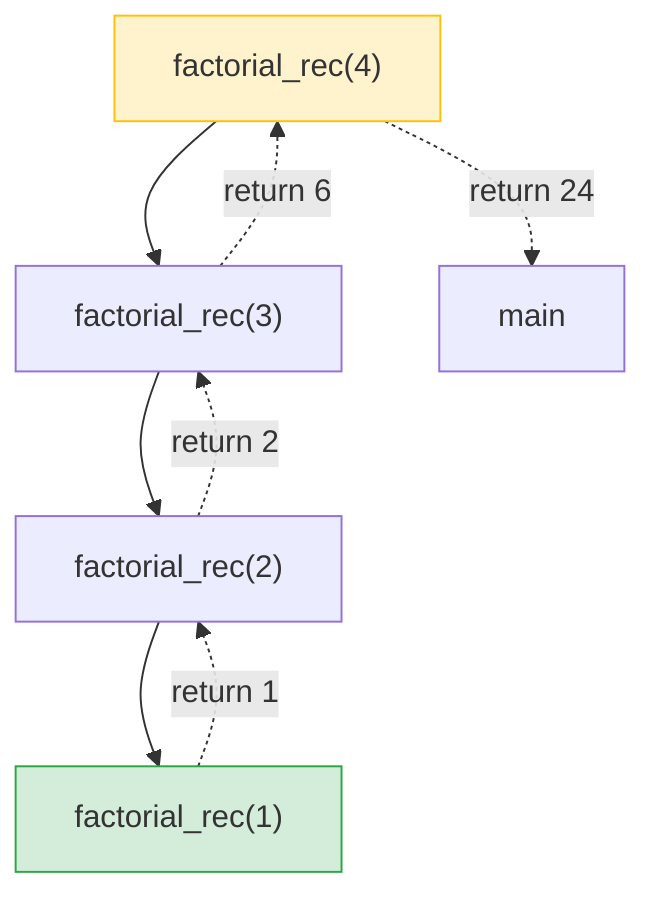
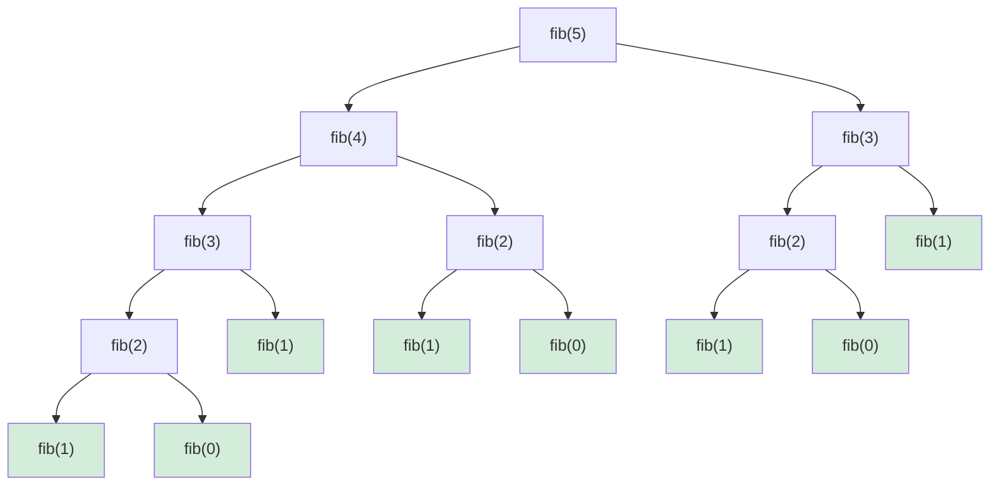
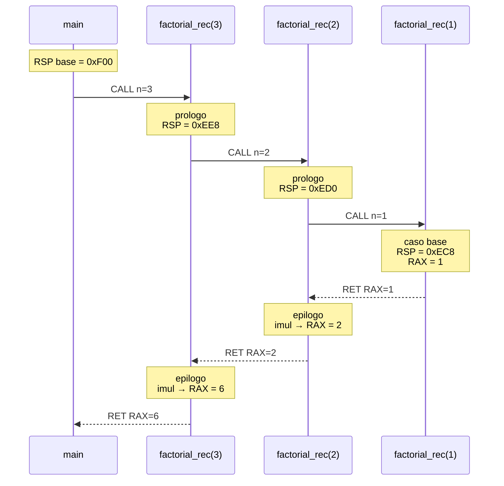
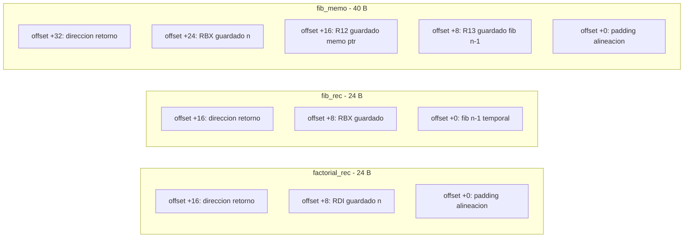
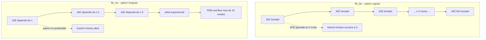

# Descripción de la arquitectura ISA utilizada en MEMARCH

**Proyecto:** MEMARCH — Memory + Architecture
**Autores:** Daniel Saucedo León, Manuel Hernández
**Institución:** UNISUR
**Documento:** `docs/isa.md` — Especificación técnica de la arquitectura objetivo
**Versión:** 1.0 — Mayo 2026

---

## Tabla de contenido

1. [Introducción](#1-introducción)
2. [Arquitectura x86-64: panorama general](#2-arquitectura-x86-64-panorama-general)
3. [Registros](#3-registros)
4. [Stack (pila)](#4-stack-pila)
5. [Modos de direccionamiento](#5-modos-de-direccionamiento)
6. [Flujo de ejecución](#6-flujo-de-ejecución)
7. [Código ASM documentado](#7-código-asm-documentado)
8. [Diagramas de ejecución](#8-diagramas-de-ejecución)
9. [Referencias](#9-referencias)

---

## 1. Introducción

MEMARCH analiza el comportamiento microarquitectónico de algoritmos recursivos e iterativos sobre la ISA **x86-64** (también denominada **AMD64** o **Intel 64**). Esta arquitectura fue introducida por AMD en 2000 como extensión de 64 bits sobre el x86 original de Intel (1978), y hoy domina el cómputo de propósito general en servidores, estaciones de trabajo y la mayoría de los equipos personales.

El proyecto utiliza esta ISA bajo el sistema operativo Linux con la **convención de llamadas System V AMD64 ABI**, ensamblador **NASM 2.16** y compilador **GCC 13.x**. Toda decisión de codificación documentada en este archivo se sustenta en los manuales oficiales de Intel y AMD, así como en la especificación del System V ABI.

---

## 2. Arquitectura x86-64: panorama general

| Característica | Valor |
|---|---|
| Tipo | CISC (Complex Instruction Set Computer) |
| Tamaño de palabra | 64 bits |
| Endianness | Little-endian |
| Bus de direcciones (canónico) | 48 bits efectivos (256 TiB virtuales) |
| Bus de datos | 64 bits |
| Registros de propósito general | 16 (de 64 bits) |
| Registros SIMD | 16–32 (XMM/YMM/ZMM, 128–512 bits) |
| Modos de operación | Long mode (64-bit y compatibility) |
| Alineación de pila | 16 bytes antes de cada `CALL` |

A nivel microarquitectónico, los procesadores modernos x86-64 son **superescalares**, **fuera de orden**, con **predicción de saltos**, **renombrado de registros** y una **jerarquía de caché** típica de tres niveles (L1 dividido en datos/instrucciones, L2 unificado por núcleo, L3 compartido). Aunque la ISA es CISC en su decodificación visible al programador, el back-end ejecuta micro-operaciones (µops) en un estilo más cercano a RISC. Este contraste entre fachada y ejecución es central para los experimentos de MEMARCH.

---

## 3. Registros

### 3.1 Registros de propósito general (GPR)

x86-64 expone 16 registros enteros de 64 bits. Cada uno permite acceso parcial a sus 32, 16 y 8 bits inferiores mediante alias:

| 64 bits | 32 bits | 16 bits | 8 bits bajos | Uso convencional (System V) |
|---------|---------|---------|--------------|-----------------------------|
| `RAX`   | `EAX`   | `AX`    | `AL`         | Valor de retorno / acumulador |
| `RBX`   | `EBX`   | `BX`    | `BL`         | Callee-saved (preservado) |
| `RCX`   | `ECX`   | `CX`    | `CL`         | 4.º argumento / contador |
| `RDX`   | `EDX`   | `DX`    | `DL`         | 3.er argumento / retorno alto |
| `RSI`   | `ESI`   | `SI`    | `SIL`        | 2.º argumento / fuente |
| `RDI`   | `EDI`   | `DI`    | `DIL`        | 1.er argumento / destino |
| `RBP`   | `EBP`   | `BP`    | `BPL`        | Base del marco (callee-saved) |
| `RSP`   | `ESP`   | `SP`    | `SPL`        | Puntero de pila |
| `R8`    | `R8D`   | `R8W`   | `R8B`        | 5.º argumento |
| `R9`    | `R9D`   | `R9W`   | `R9B`        | 6.º argumento |
| `R10`   | `R10D`  | `R10W`  | `R10B`       | Caller-saved / scratch |
| `R11`   | `R11D`  | `R11W`  | `R11B`       | Caller-saved / scratch |
| `R12`–`R15` | …    | …       | …            | Callee-saved (preservados) |

### 3.2 Detalle crítico: escrituras a registros de 32 bits

En x86-64, escribir a un registro de 32 bits **pone a cero la mitad alta de 64 bits**. Esto NO ocurre con escrituras a 16 u 8 bits. Por eso `xor eax, eax` es la forma idiomática (y más corta) de poner `RAX = 0`:

```asm
xor  eax, eax      ; RAX = 0   (3 bytes, rompe dependencia falsa)
mov  rax, 0        ; equivalente pero ocupa 7 bytes y mantiene dependencia
```

MEMARCH explota este patrón en los bucles iterativos para minimizar tamaño de código y permitir mejor renombrado de registros.

### 3.3 Registros de control y estado

- **`RIP`** — puntero de instrucción. No accesible directamente como GPR, sólo mediante direccionamiento relativo a RIP.
- **`RFLAGS`** — banderas. Las relevantes para MEMARCH:

| Bandera | Bit | Significado |
|---------|-----|-------------|
| `CF`    | 0   | Acarreo (Carry) |
| `ZF`    | 6   | Cero (Zero) |
| `SF`    | 7   | Signo (Sign) |
| `OF`    | 11  | Desbordamiento (Overflow) |
| `PF`    | 2   | Paridad |
| `AF`    | 4   | Acarreo auxiliar (BCD) |

Las instrucciones aritméticas y lógicas (`add`, `sub`, `cmp`, `dec`, `imul`) actualizan estas banderas; los saltos condicionales (`je`, `jne`, `jae`, `jb`, `jl`, `jg`, …) las consultan.

### 3.4 Convención System V AMD64 para llamadas

El ABI System V (Linux, BSD, macOS antiguos) define:

```
Argumentos enteros/punteros (en orden):
  RDI, RSI, RDX, RCX, R8, R9     → primeros 6 argumentos
  Pila                            → argumentos 7+ (en orden inverso)

Valores de retorno:
  RAX                             → primario (entero/puntero, hasta 64 bits)
  RDX:RAX                         → si el retorno es de 128 bits

Preservación:
  Callee-saved: RBX, RBP, R12–R15, RSP
  Caller-saved: RAX, RCX, RDX, RSI, RDI, R8–R11
```

> **Implicación práctica:** si una función ASM usa `RBX`, debe respaldarla con `PUSH RBX` al entrar y restaurarla antes de `RET`. Las rutinas MEMARCH siguen esta regla estrictamente.

---

## 4. Stack (pila)

### 4.1 Modelo de pila

La pila en x86-64 es una región contigua de memoria que **crece hacia direcciones bajas**. El registro `RSP` apunta siempre al elemento más reciente (tope de pila).

```
Direcciones altas
    ┌──────────────────┐
    │   ...            │
    │   argumentos     │   ← argumentos 7+ pasados a esta función
    │   dirección retorno │ ← empujada por CALL
    │   RBP del padre  │   ← si se usa marco con RBP
    ├──────────────────┤ ← RBP (si se establece)
    │   locales        │
    │   saved regs     │
    │   ...            │
    └──────────────────┘ ← RSP (tope)
Direcciones bajas
```

### 4.2 Operaciones fundamentales

| Instrucción | Efecto |
|-------------|--------|
| `PUSH reg`  | `RSP -= 8; [RSP] = reg` |
| `POP reg`   | `reg = [RSP]; RSP += 8` |
| `CALL fn`   | `PUSH RIP_siguiente; JMP fn` |
| `RET`       | `POP RIP` |
| `SUB RSP, n`| Reserva `n` bytes (sin escribir) |
| `ADD RSP, n`| Libera `n` bytes |

### 4.3 Regla de alineación de 16 bytes

El ABI exige que **`RSP` esté alineado a 16 bytes inmediatamente antes de cada `CALL`**. Como `CALL` empuja una dirección de retorno de 8 bytes, al entrar a una función `RSP` queda alineado a 16+8 = `... 8h`. Para volver a alinear antes de un `CALL` interno, se compensa con un `push` adicional o `sub rsp, 8`.

Ejemplo (de `fibo_rec_lib.asm`):

```asm
.recurse:
        push    rbx           ; RBX → RSP %16 == 0
        sub     rsp, 8        ; alineación → RSP %16 == 8 ... espere
```

> **Análisis exacto:** al entrar a `fib_rec`, `RSP` está en `...8h` (porque `CALL` empujó la dirección de retorno). El `push rbx` baja a `...0h`. El `sub rsp,8` baja a `...8h`. Antes del siguiente `CALL`, `RSP` está en `...8h`, que es lo que el ABI exige. Tras el `CALL` interno (que empuja 8 bytes más), dentro de la llamada hija `RSP` vuelve a estar en `...0h` antes del prólogo, etc.

### 4.4 Crecimiento de pila por recursión

Para una función recursiva con marco de tamaño `F` bytes y profundidad `d`, la pila consumida es aproximadamente `F · d`. MEMARCH instrumenta este valor en tiempo de ejecución mediante una variable global `rsp_minimo` actualizada en cada entrada:

```asm
mov     rax, [rel rsp_minimo]
cmp     rsp, rax
jae     .skip_update
mov     [rel rsp_minimo], rsp
.skip_update:
```

El consumo real se calcula desde C como `rsp_inicial - rsp_minimo`.

### 4.5 Red Zone

System V AMD64 define una **red zone** de 128 bytes por debajo de `RSP` que las funciones hoja pueden usar sin reservar explícitamente. MEMARCH **no** la aprovecha en las rutinas instrumentadas, porque queremos que el consumo de pila sea visible y deterministico.

---

## 5. Modos de direccionamiento

x86-64 ofrece un esquema de direccionamiento de operandos en memoria muy general. La forma canónica es:

```
[base + index*scale + displacement]
```

donde:
- `base` y `index` son registros GPR de 64 bits,
- `scale ∈ {1, 2, 4, 8}`,
- `displacement` es una constante de 8 o 32 bits.

### 5.1 Modos utilizados en MEMARCH

| Modo | Ejemplo en MEMARCH | Significado |
|------|--------------------|-------------|
| Inmediato | `mov rcx, 2` | constante codificada en la instrucción |
| Registro | `mov rax, rdx` | de registro a registro |
| Indirecto registro | `mov rax, [rsp]` | leer en la dirección que contiene `RSP` |
| Base + desplazamiento | `mov rdi, [rsi + 8]` | argv[1] = puntero en `RSI+8` |
| Base + índice escalado | `mov rax, [rsi + rdi*8]` | `memo[n]` en `fibo_memo` |
| Base + índice + desp. | `mov rax, [rbp + rdi*8 - 16]` | acceso a array local |
| Relativo a RIP | `lea rdi, [rel fmt_result]` | dirección de un símbolo (PIC) |

### 5.2 LEA: aritmética con direccionamiento

`LEA` (Load Effective Address) calcula una dirección sin acceder a memoria. Es la herramienta favorita para suma rápida sin alterar `RFLAGS`:

```asm
lea  rsi, [rax + rdx]      ; RSI = RAX + RDX  (sin tocar flags)
lea  rax, [rax + rax*2]    ; RAX = RAX * 3
lea  rdi, [rsi + rdi*8]    ; RDI = RSI + RDI*8  (índice escalado)
```

En `fibo_iter_lib.asm`, el núcleo del bucle usa `LEA` precisamente para evitar la falsa dependencia sobre `EFLAGS` que tendría un `ADD`:

```asm
.loop:
        lea     rsi, [rax + rdx]    ; a+b sin tocar flags
        mov     rax, rdx
        mov     rdx, rsi
        dec     rcx                 ; sólo aquí se actualizan flags
        jnz     .loop               ; consume sólo ZF
```

Esto permite al motor de ejecución fuera de orden despachar el cómputo de `a+b` y el control del bucle en ciclos separados sin interferencia de flags.

### 5.3 Direccionamiento relativo a RIP

x86-64 introdujo el modo `[rip + disp32]`, esencial para código independiente de posición (PIC) y obligatorio en muchas distribuciones Linux modernas (PIE por defecto). MEMARCH lo usa para acceder a símbolos globales:

```asm
mov  rax, [rel rsp_minimo]    ; equivalente a [rip + offset_rsp_minimo]
lea  rdi, [rel fmt_result]    ; cargar dirección de cadena formato
```

---

## 6. Flujo de ejecución

### 6.1 Instrucciones de control de flujo

| Categoría | Instrucciones | Uso en MEMARCH |
|-----------|---------------|----------------|
| Salto incondicional | `JMP` | bucle, fin de bloque |
| Salto condicional sin signo | `JA`, `JAE`, `JB`, `JBE` | comparaciones sobre tamaños/índices |
| Salto condicional con signo | `JL`, `JLE`, `JG`, `JGE`, `JS`, `JNS` | validación de entrada |
| Igualdad | `JE`/`JZ`, `JNE`/`JNZ` | terminación de bucle |
| Llamada/retorno | `CALL`, `RET` | recursión, llamadas a libc |
| Bucle | `LOOP` (no usado) | sustituido por `dec`+`jnz` (más eficiente) |

### 6.2 Predicción de saltos

Los procesadores modernos predicen el destino de los saltos antes de evaluarlos para mantener lleno el pipeline. El predictor tiene dos componentes relevantes:

1. **Branch Target Buffer (BTB)**: predice destinos de saltos directos e indirectos.
2. **Return Stack Buffer (RSB)**: predice destinos de `RET` apareando con `CALL` previos. Su tamaño típico es 16 entradas.

**Implicación para MEMARCH:** cuando la profundidad de recursión excede el tamaño del RSB (~16 niveles en microarquitecturas Intel modernas, hasta 32 en algunas AMD), las predicciones de `RET` empiezan a fallar, degradando el IPC. Este es uno de los efectos clave que documentan los experimentos con `fib_rec(n)` para n > 16.

### 6.3 Pipeline y dependencias

El pipeline típico de un núcleo x86-64 moderno (Intel Skylake / AMD Zen) tiene 14–19 etapas, divididas en:

- **Front-end**: fetch, predecode, decode, branch prediction.
- **Back-end**: rename, schedule, execute, retire.

Las dependencias de datos entre instrucciones consecutivas limitan el paralelismo a nivel de instrucción (ILP). El bucle de `fib_iter` tiene una cadena de dependencia de longitud 2 (mov-mov) por iteración; el de `fib_rec` tiene una cadena de profundidad O(n) en la pila de llamadas. Esta diferencia explica buena parte del contraste de IPC observado.

### 6.4 Diagrama de pipeline simplificado

```
            ┌──────┐  ┌─────────┐  ┌────────┐  ┌────────┐  ┌─────────┐  ┌────────┐
Instr → IF  │FETCH │→ │DECODE   │→ │RENAME  │→ │ISSUE   │→ │EXECUTE  │→ │RETIRE  │
            └──────┘  └─────────┘  └────────┘  └────────┘  └─────────┘  └────────┘
              ▲                        │            │
              │                        │            └─→ varios puertos de ejecución
              │                        │                 (ALU, AGU, branch, mem)
              │                        └─→ asignación de registros físicos
              │                            (rompe dependencias falsas)
              └─── BTB + RSB predicen destinos sin esperar EXECUTE
```

---

## 7. Código ASM documentado

A continuación se reproduce íntegro `factorial_rec.asm` con anotaciones línea por línea, sirviendo como ejemplo canónico de cómo se estructuran las rutinas MEMARCH.

```asm
; ==============================================================================
; factorial_rec(uint64_t n) -> uint64_t        n! = n * (n-1)!
; ==============================================================================

            global  factorial_rec
            extern  rsp_minimo

            section .text

factorial_rec:
            ; (1) Instrumentación de stack peak.
            ;     Compara RSP con el mínimo histórico. Si es menor, actualiza.
            mov     rax, [rel rsp_minimo]   ; cargar mínimo previo (rip-relative)
            cmp     rsp, rax                ; ¿RSP < rsp_minimo?
            jae     .skip_update            ; si RSP ≥ mínimo, no actualizar
            mov     [rel rsp_minimo], rsp   ; nuevo mínimo

.skip_update:
            ; (2) Caso base: n ≤ 1 → devolver 1.
            cmp     rdi, 1                  ; comparar n con 1
            ja      .recurse                ; si n > 1, recurrir
            mov     eax, 1                  ; eax=1 → rax=1 (high zero-extend)
            ret                             ; pop dirección retorno → RIP

.recurse:
            ; (3) Prólogo: preservar n a través del CALL.
            ;     RDI es caller-saved → desaparecería tras el CALL recursivo.
            push    rdi                     ; guardar n en pila
            sub     rsp, 8                  ; alinear RSP a 16 antes de CALL

            ; (4) Llamada recursiva con n-1.
            dec     rdi                     ; RDI ← n-1
            call    factorial_rec           ; RAX ← (n-1)!

            ; (5) Epílogo: recuperar n y combinar.
            add     rsp, 8                  ; liberar alineación
            pop     rdi                     ; RDI ← n original
            imul    rax, rdi                ; RAX ← n × (n-1)! = n!
            ret

            section .note.GNU-stack noalloc noexec nowrite progbits
```

**Lectura interpretativa por bloque:**

| Bloque | Instrucciones | Propósito |
|--------|---------------|-----------|
| (1) | 4 | Instrumentación no intrusiva; añade ~4 µops por llamada. |
| (2) | 3 | Caso base. Salida temprana sin tocar pila. |
| (3) | 2 | Reserva de 16 bytes alineados (8 útiles + 8 padding). |
| (4) | 2 | Decremento y recursión. |
| (5) | 4 | Restauración, multiplicación final y retorno. |

**Tamaño de marco por nivel:** 16 bytes (1 push + 8 sub) + 8 bytes de dirección de retorno = **24 bytes**. Para `factorial_rec(20)`, el consumo medido empíricamente fue **464 bytes**, lo que equivale a ~23 bytes por nivel, coincidiendo con la predicción teórica (el byte de diferencia se debe a la observación del primer frame antes de cualquier sub).

---

## 8. Diagramas de ejecución

### 8.1 Árbol de llamadas: `factorial_rec(4)`

Recursión lineal: cada nodo invoca exactamente uno hijo. Profundidad = n.



### 8.2 Árbol de llamadas: `fib_rec(5)`

Recursión binaria: cada nodo invoca dos hijos. Número total de llamadas: 2·fib(n+1)−1.



> **Observación MEMARCH:** las hojas verdes (`fib(0)` y `fib(1)`) representan cómputo trivial pero costoso en agregado. Para `n=30`, hay ~832,040 hojas. Cada una atraviesa el pipeline, predicción de saltos y `RET`, generando el costo observado de 25 ms.

### 8.3 Evolución de la pila en `factorial_rec(3)`



> **Lectura del diagrama:** cada `CALL` empuja 8 bytes (dirección de retorno); el prólogo de la función añade 16 bytes más (`push rdi` + alineación), por lo que el RSP desciende 24 bytes por nivel de recursión. Los valores `0xF00`, `0xEE8`, etc. son los 12 bits inferiores del RSP en una corrida típica; los bits altos se omiten por claridad.

### 8.4 Pipeline del bucle iterativo `fib_iter`

Cuerpo del bucle (5 instrucciones) ejecutándose en paralelo gracias al renombrado de registros. Tres iteraciones consecutivas se solapan:

```
Ciclo:        1     2     3     4     5     6     7     8     9
              │     │     │     │     │     │     │     │     │
Iter 1:      [LEA] [MOV] [MOV] [DEC] [JNZ]
Iter 2:            [LEA] [MOV] [MOV] [DEC] [JNZ]
Iter 3:                  [LEA] [MOV] [MOV] [DEC] [JNZ]
Iter 4:                        [LEA] [MOV] [MOV] [DEC] [JNZ]
Iter 5:                              [LEA] [MOV] [MOV] [DEC] [JNZ]

                Throughput efectivo: ~1 iteración por ciclo
                IPC ≈ 5 instr/iter ÷ 1 ciclo/iter ≈ 5
```

> El IPC real está limitado por el ancho del front-end (4–6 µops/ciclo en Intel Skylake+ / AMD Zen). En la práctica se observa IPC en el rango 3–4, no 5, porque el front-end no puede sostener 5 µops/ciclo de forma indefinida.

### 8.5 Contraste: pipeline de `fib_rec`

```
Ciclo:        1       2       3       4       5       6       ...
              │       │       │       │       │       │
CALL fib(n-1) [decode][rename][issue ][exec  ][stall ][stall ]
                                                  ↑
                                       Espera resultado de la rama
                                       completa antes de empezar fib(n-2)

CALL fib(n-2)                                  [decode][rename]...
                                                          ↑
                                       Inicia sólo cuando fib(n-1) retorna

IPC efectivo ≈ 1.2 – 1.5 (limitado por dependencia secuencial
                          entre las dos llamadas recursivas)
```

### 8.6 Comparativa de marcos de pila



### 8.7 Flujo del predictor de saltos en `fib_iter` vs `fib_rec`



---

## 9. Referencias

1. **Intel Corporation.** *Intel® 64 and IA-32 Architectures Software Developer's Manual.* Volúmenes 1–4, edición 2024. <https://www.intel.com/sdm>
2. **Advanced Micro Devices.** *AMD64 Architecture Programmer's Manual.* Volúmenes 1–5, revisión 3.39, 2023. <https://www.amd.com/system/files/TechDocs/40332.pdf>
3. **Matz, M.; Hubička, J.; Jaeger, A.; Mitchell, M.** *System V Application Binary Interface — AMD64 Architecture Processor Supplement (with LP64 and ILP32 programming models).* Versión 1.0, 2024. <https://gitlab.com/x86-psABIs/x86-64-ABI>
4. **NASM Development Team.** *The Netwide Assembler — NASM Manual.* Versión 2.16, 2023. <https://nasm.us/doc>
5. **Fog, A.** *Optimizing subroutines in assembly language: An optimization guide for x86 platforms.* Technical University of Denmark, 2023. <https://www.agner.org/optimize/>
6. **Hennessy, J. L.; Patterson, D. A.** *Computer Architecture: A Quantitative Approach.* 6.ª ed., Morgan Kaufmann, 2017.
7. **Bryant, R. E.; O'Hallaron, D. R.** *Computer Systems: A Programmer's Perspective.* 3.ª ed., Pearson, 2016.

---

<p align="center"><em>Doctorado en Sistemas UNISUR</em></p>
